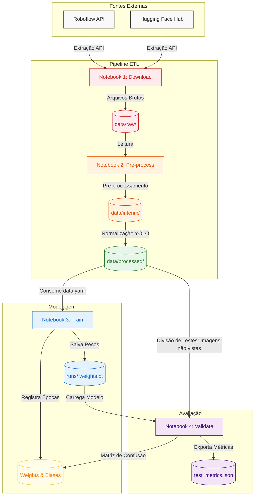
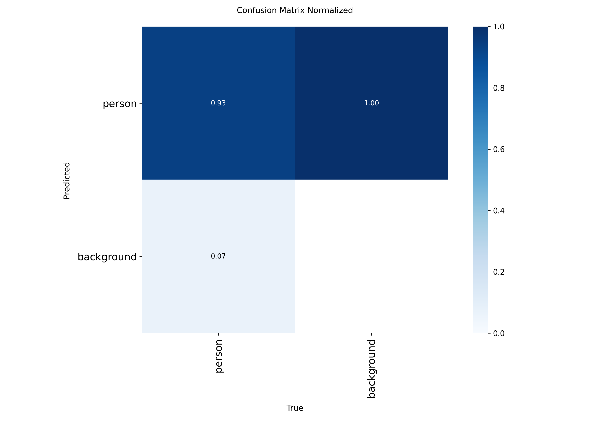
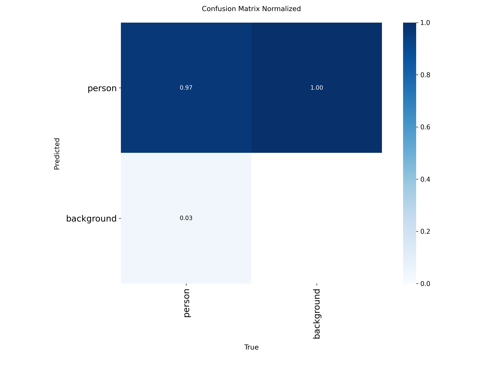
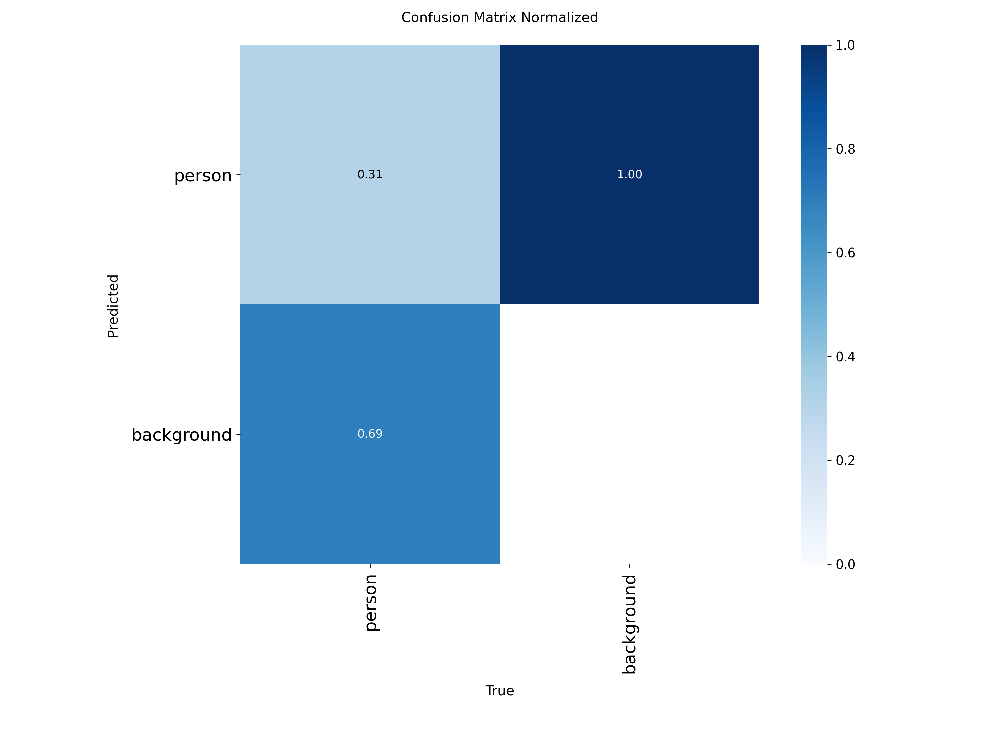

# `Contagem de passageiros em ônibus utilizando visão computacional (análise de imagens e reconhecimento de padrões).`
# `Counting passengers on buses using computer vision (image analysis and pattern recognition).`

## Apresentação

O presente projeto foi originado no contexto das atividades da disciplina de pós-graduação *IA901 - Análise de Imagens e Reconhecimento de Padrões*, 
oferecida no primeiro semestre de 2026, na Unicamp, sob supervisão da Profa. Dra. Leticia Rittner, do Departamento de Engenharia de Computação e Automação (DCA) da Faculdade de Engenharia Elétrica e de Computação (FEEC).

<!-- > Incluir nome RA e foco de especialização de cada membro do grupo. Os projetos devem ser desenvolvidos em duplas ou trios. -->
> |Nome  | RA | Curso|
> |--|--|--|
> | Vinícius de Souza Trentin  | 298990  | Mestrado em Engenharia Elétrica com ênfase em computação|
> | Cristian Javier Maza Merchan  | 272289  | Doutorado em Engenharia Elétrica |


## Descrição do Projeto
<!-- > 
Descrição do objetivo principal do projeto, incluindo contexto gerador, motivação, etc. 
Qual problema o grupo pretendia solucionar?
Qual a relevância do problema e o impacto da solução do mesmo? 
-->

O objetivo do projeto é desenvolver um algoritmo capaz de detectar e contabilizar o número de passageiros presentes em imagens no interior de ônibus. A solução utilizará técnica de transfer learning a partir de modelos de detecção de objetos pré-treinados, como YOLOv8 ou YOLOv11 treinados no dataset COCO para a classe "person". Diversos datasets públicos que contem imagens de pessoas em ônibus possuem precisão elevada(mais de 90%), porém quando são colocados em situações diferentes, como validando com uma imagem de outro dataset, essa precisão diminui, chegando em torno de 30%, como será demonstrado posteriormente.

A relevância deste projeto reside na tentativa de desenvolver um algoritmo de detecção de passageiros que tenha uma boa precisão na detecção em diferentes cenários, a noção da quantidade de passageiros em ônibus pelo tempo contribui na otimização da mobilidade urbana e na análise de impacto da massa de passageiros, sendo importante para o consumo energético de ônibus elétricos, com aplicação direta no ônibus elétrico da Unicamp.

## Metodologia
<!-- >
Abordagem adotada pelo projeto na busca pela resposta às perguntas de pesquisa. Justificar teoricamente, sempre que possível, a metodologia adotada. 
-->
A metodologia consiste na aplicação de Redes Neurais Convolucionais (CNNs), principalmente da arquitetura da família YOLO **YOLOv8** e **YOLO11** (especificamente a variante *medium*, YOLO11m) para extração de características espaciais e detecção de instâncias, no caso pessoas. O escopo central da pesquisa consiste em avaliar comparativamente o impacto de estratégias de transferência de aprendizado (*Transfer Learning*) e ajuste fino (*Fine-Tuning*) na redução do gap de domínio (*domain gap*) e no aumento da robustez contra oclusões severas em ambientes de transporte público.

O núcleo do projeto avaliará comparativamente duas estratégias de Transfer Learning e Fine-Tuning:

1. **Fine-tuning direto (Baseline):** Utilização do modelo pré-treinado e realização do fine-tuning diretamente nas imagens anotadas do interior dos ônibus(datasets públicos). Esta é a abordagem mais simples e foi utilizada como base para a avaliação de desempenho.

2. **Fine-tuning em estágios (Robusto):** Implementação de um treinamento seguencial, em que fo realizado um fine-tuning inicial em um dataset de cenas de multidões(Crowd Human Dataset) para melhorar a robustez contra oclusões. Em seguida, foi aplicado um segundo fine-tuning com as imagens de passageiros no interior do ônibus, fechando o gap de domínio progressivamente.

### Avaliação de Generalização e Validação:

Para ambas as abordagens, etapas sequenciais foram executadas com o objetivo de comparar a precisão documentada nos datasets de origem e validá-la por meio de validação cruzada(cross-dataset), utilizando ausentes do conjunto de treinamento. Como exemplo, aplicar inicialmente o aprendizado por transferência(Transfer Learning) utilizando o dataset "Passenger Detection on a Bus" para estabelecer a precisão de referência. Em sequência, o modelo será avaliado com um subconjunto de imagens tratadas do dataset "Inside Bus View", com o intuito de analisar a eventual degradação da precisão em novos cenários.

### Pré-processamento e Robustez

Adicionalmente, com o intuito de mitigar o risco de sobreajuste (overfitting) e aprimorar a robustez do modelo frente a diferentes ambientes, serão aplicados métodos de pré-processamento. Tais métodos englobam o remapeamento de classes, como a conversão da classe "occupied seat" para "person" no dataset "Inside Bus View", e a exclusão de categorias irrelevantes. Paralelamente, técnicas de aumento de dados (Data Augmentation) serão empregadas para simular variações de iluminação (como ajustes de brilho e contraste) e inserção de oclusões artificiais. 

A validação final será conduzida utilizando o dataset privado da Unicamp, visando aferir o desempenho do modelo em condições reais de operação.

## Bases de Dados
<!-- > 
Elencar as bases de dados utilizadas no projeto. 

Faça uma descrição sobre o que o grupo concluiu sobre esta base. Sugere-se que respondam perguntas ou forneçam informações indicadas a seguir:
* Qual o formato dessa base, tamanho, tipo de anotação?
* Quais as transformações e tratamentos feitos? Limpeza, reanotação, etc.
* Utilize tabelas e/ou gráficos que descrevam os aspectos principais da base que são relevantes para o projeto.

Forneça também o link para o "datasheet" criado para os datasets (anexado na pasta `data`, como indicado nas [instruções E2](https://github.com/Disciplinas-FEEC/IA901-2026S1/blob/main/templates/ia901-E2-instructions.md)), contendo informações mais detalhadas e sistematizadas sobre as bases de dados.
-->
O projeto implementa uma arquitetura de dados baseada no padrão Medalhão dividida em três camadas de persistência (`data/raw`, `data/interim` e `data/processed`). Os dados brutos originais são extraídos de forma imutável de suas respectivas fontes web e consolidados via rotinas automatizadas Python.

### Resumo Descritivo dos Datasets

| Base de Dados | Endereço na Web | Resumo descritivo |
| ----- | ----- | ----- |
| Passenger Detection on a Bus | [Roboflow Universe](https://universe.roboflow.com/bus-project-frdgz/passenger-detection-on-a-bus-qgljh) | 170 imagens (.jpg) de passageiros em ônibus com bounding boxes precisas. Será utilizada para treinamento (Etapa 1 e 2) |
| Inside Bus View | [Roboflow Universe](https://universe.roboflow.com/seat-occupancy/inside-bus-view) | 1.400 imagens (.jpg) com anotações de assentos ocupados, que serão remapeadas para a classe "person". Será utilizada para treinamento e teste (Etapa 1 e 2)  |
| Crowd Human Dataset | [CrowdHuman.org](https://www.crowdhuman.org/) | 19.370 imagens (.jpg) contendo instâncias humanas em cenas densas para o treinamento em estágios. Será utilizada para treinamento(Etapa 2)  |
| Passenger (Deakin) | [Roboflow Universe](https://universe.roboflow.com/deakin-07shj/passenger-mmpbi) | 4181 imagens (.jpg), será aplicada subamostragem (1 a cada 40 frames) resultando em torno de 100 imagens (.jpg). Será utilizada para treinamento e teste(Etapa 1 e 2) |
| Dataset Privado (Unicamp) | N/A | 2.400 imagens (.jpeg) coletadas no ônibus elétrico da Unicamp para rotulação manual e validação final. |

<!-- > Forneça também o link para o "datasheet" criado para os datasets (anexado na pasta `data`, como indicado nas [instruções E2](https://github.com/Disciplinas-FEEC/IA901-2026S1/blob/main/templates/ia901-E2-instructions.md)), contendo informações mais detalhadas e sistematizadas sobre as bases de dados. -->

### Transformações e Tratamentos Aplicados (Camada Processed)

Para padronizar os dados e viabilizar a convergência das arquiteturas YOLOv8 e YOLO11, o pipeline de pré-processamento executado em `2_preprocess_datasets.ipynb` (com suporte do módulo `src/datasets.py`) submete os dados brutos aos seguintes tratamentos determinísticos:

1. **Remapeamento de Classes para Alvo Único (`nc=1`):** Redução categórica obrigatória para unificar o escopo estritamente na classe `person` (ID `0`). No dataset *Inside Bus View*, as anotações nativas rotuladas originalmente como `occupied seat` foram remapeadas programaticamente para `person`. Classes espúrias ou irrelevantes ao problema de contagem foram integralmente descartadas do arquivo final.
2. **Normalização e Parsing de Coordenadas:** Conversão de anotações complexas e polígonos em formatos de caixas delimitadoras normatizadas (*bounding boxes*) padrão YOLO, expressas em coordenadas relativas de centro da caixa e dimensões de borda $[cx, cy, nw, nh]$ limitadas rigidamente no intervalo $[0.0, 1.0]$ para evitar erros de consistência.
3. **Reamostragem e Controle de Reprodutibilidade (CrowdHuman):** Devido à volumetria massiva do CrowdHuman original (mais de 19 mil imagens), foi desenvolvido um motor de amostragem aleatória determinística (fixado com `seed=42`) para extrair splits balanceados e compactos na camada `processed` (ex: 800 imagens de treino, 200 de validação e 200 de teste), viabilizando ciclos rápidos de iteração de código (*Fast Mode*).
4. **Geração de Metadados de Runtime:** Criação automática de arquivos de ancoragem `data.yaml` e arquivos ocultos de validação de integridade (`.download_complete`) para garantir que o motor de treinamento consuma os caminhos de forma correta e limpa.

> **Nota sobre os Datasheets:** Os documentos detalhados de especificação (*datasheets*) contendo a distribuição interna de caixas, volumetria final pós-limpeza e análises estatísticas encontram-se estruturados no diretório [`data/`](data/). Por questões de otimização de armazenamento no GitHub, os gráficos de distribuição descritiva foram incorporados diretamente nos painéis das respectivas bases no Roboflow.

## Ferramentas
<!-- > 
Panorama das ferramentas utilizadas incluindo uma breve discussão sobre o uso das mesmas. 
-->
O desenvolvimento deste projeto possui uma arquitetura possuindo reprodutibilidade, rastreabilidade e bom desempenho na extração de características.

* **Modelos Base e Deep Learning:**
  * **Família YOLO (Ultralytics):** Utilização das arquiteturas estado-da-arte YOLOv8 e YOLO11 (com foco nas variantes *medium*, como YOLO11m) devido ao excelente balanço entre precisão de detecção (mAP) e velocidade de inferência, requisito importante na questão de escalabilidade pelo "custo benefício".
  * **PyTorch:** Framework base subjacente para processamento de tensores e aceleração de hardware via CUDA, permitindo o treinamento otimizado com grandes matrizes de dados.

* **Engenharia de Dados (Pipeline ETL):**
  * **Roboflow API:** Plataforma adotada para gestão, anotação e versionamento automatizado dos datasets do domínio alvo (imagens do interior dos ônibus).
  * **Hugging Face Hub:** Utilizado para a extração programática dos arquivos brutos e anotações matriciais do dataset de domínio geral (CrowdHuman) utilizado na etapa de robustez.
  * **Pillow, OpenCV e NumPy:** Stack base para decodificação de imagens, normalização de coordenadas de *bounding boxes* e formatação dos conjuntos de dados.

* **Monitoramento e Gestão de Experimentos (MLOps):**
  * **Weights & Biases (WandB):** Ferramenta central para o rastreamento do ciclo de vida dos modelos. Utilizada para registrar métricas de perda (*loss*) em "tempo real", gerar painéis de validação visual preditiva e gerenciar as execuções sistemáticas da busca em grade (*Grid Search*) para a otimização dos hiperparâmetros.

* **Ambiente de Desenvolvimento:**
  * **Python 3.12 e Jupyter Notebooks:** Orquestração do fluxo de trabalho estruturada no padrão Raw, Interim, Processed. A base de código implementa tipagem estática e documentação padronizada para assegurar a confiabilidade da pesquisa.

## Workflow reprodutível
<!-- > 
Use uma ferramenta que permita desenhar o workflow e salvá-lo como uma imagem (Draw.io, por exemplo). Insira a imagem nesta seção.
Você pode optar por usar um gerenciador de workflow (Sacred, Pachyderm, etc) e nesse caso use o gerenciador para gerar uma figura para você.
Lembre-se: o objetivo de desenhar o workflow é ajudar a quem quiser reproduzir seus experimentos!!!

-->

A arquitetura do projeto foi estruturada visando a total reprodutibilidade e o princípio de Separação de Preocupações (SoC). O pipeline foi dividido em notebooks modulares, estabelecendo limites claros entre a engenharia de dados (ETL), a modelagem (Treinamento) e a validação de hipóteses (Avaliação).

### Tabela de Artefatos e Rastreabilidade

| Etapa | Módulos e Notebooks | Entrada | Saída (Artefato) |
| --- | --- | --- | --- |
| **1. Extração (Download)** | `1_download_datasets.ipynb`<br>`src/datasets.py` | API do Roboflow e Hugging Face Hub | `data/raw/<dataset>/` |
| **2. Pré-processamento** | `2_preprocess_datasets.ipynb`<br>`src/datasets.py` | `data/raw/<dataset>/` | Rascunhos em `data/interim/`<br>Dataset final em `data/processed/<dataset>/` |
| **3. Treinamento** | `3_train.ipynb`<br>`src/train.py`<br>`src/wandb_utils.py` | `data/processed/<dataset>/data.yaml` | Pesos do modelo (`runs/<exp>/weights/`)<br>Logs no Weights & Biases |
| **4. Validação (Robustez)** | `4_validate_test.ipynb`<br>`src/eval.py`<br>`src/wandb_utils.py` | Pesos treinados (`best.pt`)<br>Domínio não visto (`data/processed/`) | `runs/<exp>/test_metrics.json`<br>Painel de predições no W&B |

<!-- Fazer um workflow melhor no Miro -->
O fluxograma abaixo ilustra o ciclo de vida dos dados, desde as fontes externas até a consolidação das métricas de avaliação no Weights & Biases.



As instruções de execução dos notebooks ficam em [`src/README.md`](src/README.md).
Detalhes do registro no Weights & Biases ficam em [`docs/WANDB.md`](docs/WANDB.md).

## Experimentos e Resultados
<!-- > 
Descrição dos resultados mais importantes obtidos.
Apresente os resultados da forma mais rica possível, com gráficos e tabelas. Mesmo que o seu código rode online em um notebook, copie para esta parte a figura estática. A referência a código e links para execução online pode ser feita também, mas é preciso apresentar os principais resultados neste documento.
-->

### Experimentos:

Os experimentos iniciais utilizarão o modelo YOLO base para estabelecer o baseline de performance. Como primeiro experimento foi feito um treinamento utilizando o dataset Passenger Detection on a Bus, esse dataset possui 170 imagens de pessoas em ônibus, os dados foram pré processados utilizando orientação sempre na horizontal e na escala 640x640 fit com preenchimento preto nas bordas para não distorcer as imagens. Como data augmentation foram utilizadas as técnicas de:
* Flip Mirror horizontally: Dobra o dataset sem distorcer a física da imagem, fazendo com que tenha imagens de pessoas que estavam na esquerda ficarem também na direita, já que os ônibus são simétricos.
* Mosaic: Combina 4 imagens em 1, fazendo com que a rede "foque" em contextos variados.
* Brightness: Variar o brilho da imagem, regulável, escolhemos de +/- 15%
* Exposure: Variar a exposição da imagem, regulável, escolhemos de +/- 10%
* Cutout: Caixas pretas aleatórias que irão cobrir alguma parte da imagem, também é regulável, escolhemos de 3 x 10%, esse parâmetro pode ajudar no problema de oclusão, mesmo que um quadrado preto(simulando alguma oclusão, como uma barra de ferro do ônibus, poltrona,...) esconder alguma parte do corpo de uma pessoa, o restante ainda é um passageiro.
* Rotation: rotação variável, escolhemos de +/- 10% para simular a variação que pode acontecer da câmera do ônibus balançar/trepidar.
* Blur: Aplicar efeito de "embaçamento", escolhemos para ser menor ou igual a 1px, pois acreditamos que pelas imagens isso não acontece tanto e poderia piorar o modelo.
* Motion Blur: semelhante ao blur, porém simulando uma movimentação, escolhemos como parâmetro 50px 0 graus e 1 frame.
* Hue, variar a escala de cores da imagem, escolhemos +/- 15%. Esse parâmetro ajuda o modelo não ficar tão inviesado em relação a cores, como de roupas e tom de pele.
* Saturation: Variar a saturação da imagem, escolhemos de +/- 25%, câmeras simples(como a do ESP32-CAM, utilizada no modelo do dataset privado no ônibus da Unicamp, ou câmeras similares) costumam ter um balanço de branco ruim, deixando a imagem mais "azulada" ou "amarelada"(cores frias e quentes), a saturação também pode ajudar na questão de viés em relação a cores que nem o Hue.
* Crop: Variar corte ou zoom, escolhemos de 0 a 20%, essa técnica aproxima a imagem artificialmente, pode ajudar o modelo aprender a detectar pessoas que estão coladas na câmera, que pode acontecer

Para visualização de alguns dos resultados preliminares disponibilizamos um pasta no Google Drive com simulações do dataset Passenger Detection on a Bus e Inside Bus View e será mostrado algumas imagens abaixo de parte dos resultados.

### Runs Google Drive

```sh
  https://drive.google.com/drive/folders/1mELdfdfAS4YE39bwXNG4FGVBLFEm-mYM?usp=drive_link
```

De `Epoch` foram utilizadas 300 para o treinamento. 

No roboflow do repositório Passenger Detection on a Bus estava com uma precisão de 91.1%, com o nosso treinamento feito ficou com uma precisão de 93%.

*Matriz de confusão normalizada Passenger Detection on a Bus*



No roboflow do repositório Inside Bus Detection estava com uma precisão de 90.2%, com o nosso treinamento feito ficou com uma precisão de  97%, porém utilizando o modelo do primeiro dataset nesse dataset para validar e verificar a precisão, diminuiu para 31% evidenciando o problema que retratamos de um dataset ficar específico para o conjunto de imagens treinados e quando jogado em outro dataset cair drasticamente a precisão.

*Matriz de confusão normalizada Inside Bus Detection*


*Matriz de confusão normalizada Inside Bus Detection Validação cruzada*


**Problemas identificados:**
* Risco elevado de oclusão severa gerando subcontagem (falsos negativos) e sobreposição de detecções (contagem dupla).
* Viés de dataset (overfitting) e necessidade de simular diversidade, como de iluminação, dos parâmetros de data augmentation, porém mesmo utilizando esses parâmetros o caso ao contrário do primeiro dataset(Passenger Detection on a Bus) sendo para ser validado no Inside Bus View também ficou com precisão bem abaixo.
* Dataset "passenger_count" foi avaliado preliminarmente e excluído devido a problemas severos de anotação (bounding boxes cobrindo múltiplas pessoas).

### Resultados:

## Discussão
<!-- 
Discussão dos resultados. Relacionar os resultados com as perguntas de pesquisa ou hipóteses avaliadas.
A discussão dos resultados também pode ser feita opcionalmente na seção de Resultados, na medida em que os resultados são apresentados. Aspectos importantes a serem discutidos: É possível tirar conclusões dos resultados? Quais? Há indicações de direções para estudo? São necessários trabalhos mais profundos?
-->

## Conclusão
<!-- 
Destacar as principais conclusões obtidas no desenvolvimento do projeto.
Destacar os principais desafios enfrentados.
Principais lições aprendidas.
-->

## Trabalhos Futuros
<!-- O que poderia ser melhorado se houvesse mais tempo? -->
* Detecção de Oclusão em Ambientes de Alta Densidade: Embora a metodologia de fine-tuning em estágios com o dataset CrowdHuman tenha mitigado problemas de oclusão, o uso de módulos de estimativa de densidade (density map estimation), inspirados em arquiteturas como CSRNet, poderia ser investigado para cenários de superlotação extrema, onde a contagem por detecção individual de caixas (bounding boxes) tende a saturar.
* Privacidade e Ética de Dados: Pesquisas futuras poderiam integrar módulos de anonimização automática diretamente no pipeline de pré-processamento, utilizando técnicas de blurring de rostos ou segmentação semântica para garantir a conformidade com leis de proteção de dados (LGPD) sem comprometer a capacidade de extração de características espaciais necessárias para a contagem.

## Uso de IA Generativa
<!-- > 
Adicione aqui em quais tarefas foi usada alguma ferramenta de IA Generativa. Para cada tarefa indicada detalhe qual a ferramenta e qual o prompt utilizado. 
-->
Durante o desenvolvimento deste projeto e a elaboração desta documentação, ferramentas de IA Generativa foram utilizadas estritamente para auxiliar na estruturação visual, diagramação e formatação do texto do repositório, não interferindo na concepção da metodologia. Abaixo estão os detalhes das tarefas:

* **Tarefa:** Apoio ao desenvolvimento e organização do código do projeto, incluindo estruturação dos módulos em `src/` e adaptação do notebook para funções reutilizáveis.
  * **Ferramenta:** Cursor
  * **Forma de uso:** Interação iterativa em linguagem natural durante a implementação, sem um único prompt principal; as sugestões foram revisadas, testadas e ajustadas pelos autores.

* **Tarefa: Geração do código do diagrama de Workflow**
  * **Ferramenta:** Gemini
  * **Prompt utilizado:** Fornecimento do texto descritivo das seções de "Metodologia" e "Experimentos" do README, seguido do comando: *"Preciso gerar uma imagem do meu workflow para meu projeto"*. A IA processou o texto e gerou o código em linguagem Mermaid, que foi posteriormente importado para a plataforma Mermaid e ajustado para a exportação da imagem final.

* **Tarefa: Estruturação e formatação das Referências Bibliográficas**
  * **Ferramenta:** Gemini
  * **Prompt utilizado:** Fornecimento dos links brutos (URLs) das bases de dados, bibliotecas e documentações, acompanhado do comando: *"Preciso ajustar minhas referencias para meu .md"*. A ferramenta categorizou os links e aplicou a sintaxe correta de hiperlinks nativa do Markdown.

## Referências
<!-- > Seção obrigatória. Inclua aqui referências utilizadas no projeto. -->
**Bibliotecas e Frameworks**
* **[PyTorch](https://pytorch.org/):** Framework principal de Deep Learning utilizado no projeto.
  > *Nota de instalação (versão estável com suporte a CUDA 12.6):* > `pip3 install torch torchvision --index-url https://download.pytorch.org/whl/cu126`
* **[Ultralytics (YOLO)](https://docs.ultralytics.com/):** Documentação oficial das arquiteturas YOLOv8 e YOLOv11 utilizadas para a detecção de objetos.

**Bases de Dados (Datasets)**
* **[Roboflow - Passenger Detection on a Bus](https://universe.roboflow.com/bus-project-frdgz/passenger-detection-on-a-bus-qgljh):** Dataset utilizado para o treinamento e detecção de passageiros no interior de ônibus.
* **[Roboflow - Inside Bus View](https://universe.roboflow.com/seat-occupancy/inside-bus-view):** Dataset focado na visão interna do ônibus (anotações de assentos mapeadas para passageiros).
* **[Roboflow - Passenger (Deakin)](https://universe.roboflow.com/deakin-07shj/passenger-mmpbi):** Dataset auxiliar de passageiros utilizado para compor as bases de treinamento e validação.
* **[CrowdHuman Dataset (Página Oficial)](https://www.crowdhuman.org/):** Página oficial do dataset de multidões utilizado para o fine-tuning em estágios, visando maior robustez contra oclusões.
* **[CrowdHuman Dataset (Hugging Face)](https://huggingface.co/datasets/sshao0516/CrowdHuman):** Repositório do dataset CrowdHuman hospedado no Hugging Face.

**Ferramentas de Experimentação e MLOps**
* **[Weights & Biases](https://wandb.ai/site/):** Plataforma integrada para o registro de experimentos, monitoramento de métricas de convergência (mAP@50/95) e visualização de predições em ambiente de teste.