# `Contagem de passageiros em ônibus utilizando visão computacional (análise de imagens e reconhecimento de padrões).`
# `Counting passengers on buses using computer vision (image analysis and pattern recognition).`

## Apresentação

O presente projeto foi originado no contexto das atividades da disciplina de pós-graduação *IA901 - Análise de Imagens e Reconhecimento de Padrões*, 
oferecida no primeiro semestre de 2026, na Unicamp, sob supervisão da Profa. Dra. Leticia Rittner, do Departamento de Engenharia de Computação e Automação (DCA) da Faculdade de Engenharia Elétrica e de Computação (FEEC).

<!-- > Incluir nome RA e foco de especialização de cada membro do grupo. Os projetos devem ser desenvolvidos em duplas ou trios. -->
> |Nome  | RA | Curso|
> |--|--|--|
> | Vinícius de Souza Trentin  | 298990  | Mestrado em Engenharia Elétrica com ênfase em computação|
> | Cristian Javier Maza Merchan  | 272289  | Doutorado em Engenharia Elétrica |

## Descrição do Projeto
<!-- > 
Descrição do objetivo principal do projeto, incluindo contexto gerador, motivação, etc. 
Qual problema o grupo pretendia solucionar?
Qual a relevância do problema e o impacto da solução do mesmo? 
-->

O objetivo do projeto é desenvolver um modelo genérico capaz de detectar e contabilizar o número de passageiros (pessoas) presentes em imagens no interior de ônibus em diferentes cenários e datasets. A solução utiliza técnicas de transfer learning a partir de modelos de detecção de objetos pré-treinados, como YOLOv8 ou YOLOv11 treinados no dataset COCO para a classe "person".

<table align="center">
  <tr>
    <td align="center" width="50%">
      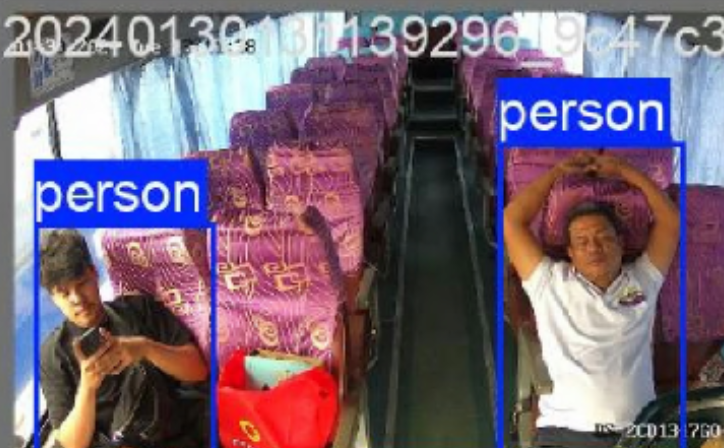
       
      <b>Detecção da Classe Person</b>
    </td>
    <td align="center" width="50%">
      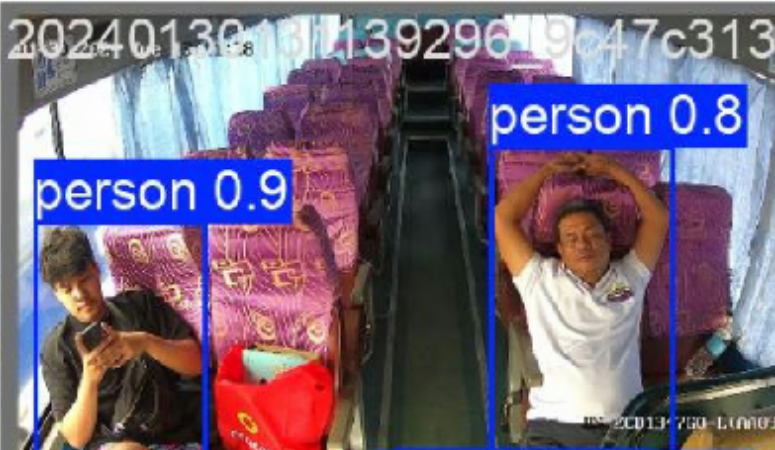
       
      <b>Detecção com Níveis de Confiança</b>
    </td>
  </tr>
</table>

O principal problema abordado é a "ilusão da alta precisão" em datasets específicos. Diversos datasets públicos possuem precisão elevada (ex: 93% em testes in-domain), porém quando os modelos são submetidos à validação cruzada (cross-dataset), a precisão cai drasticamente (chegando a 31%). Esse viés de dataset (overfitting de cenário) ocorre porque o modelo "decora" a iluminação, ângulos exatos das câmeras e texturas dos fundos, apresentando severa inflexibilidade de domínio.

<table align="center">
  <tr>
    <td align="center" width="40%">
      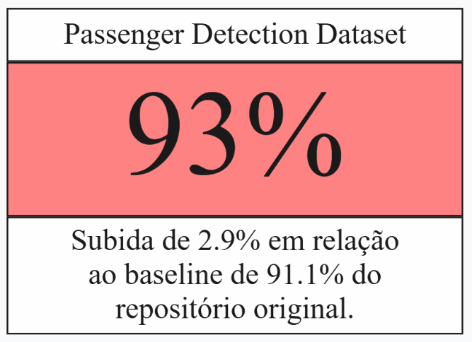
       
      <b>Métrica de Referência (In-Domain)</b>
    </td>
    <td align="center" width="60%">
      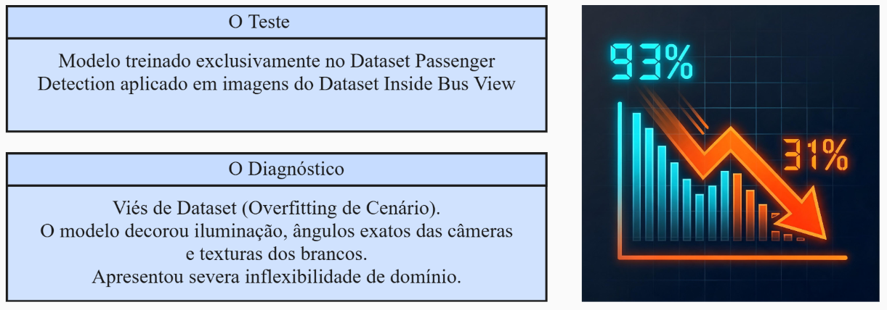
       
      <b>Diagnóstico de Inflexibilidade de Domínio</b>
    </td>
  </tr>
</table>

A relevância deste projeto reside na tentativa de desenvolver um algoritmo de detecção robusto contra falsos positivos complexos (ex: reflexos nos vidros), falsos negativos por oclusão e contagem dupla causada por obstáculos físicos como barras de apoio. A contagem precisa contribui para a otimização da mobilidade urbana e na análise de impacto da massa de passageiros no consumo energético de ônibus elétricos (aplicação direta no ônibus elétrico da Unicamp).

<table align="center">
  <tr>
    <td align="center" width="50%">
      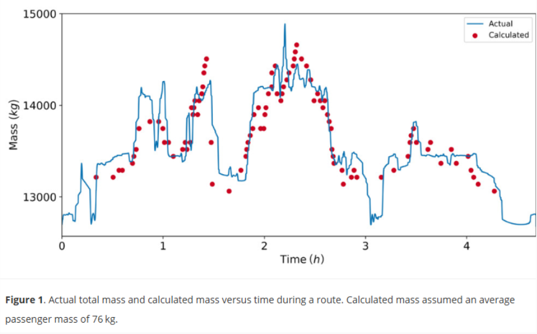
       
      <b>Variação da Massa Total ao Longo da Rota</b>
    </td>
    <td align="center" width="50%">
      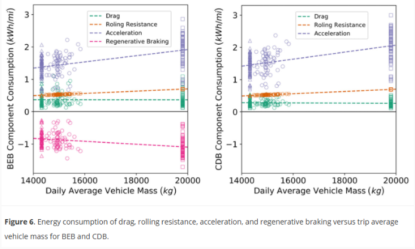
       
      <b>Impacto no Consumo Energético (BEB vs CDB)</b>
    </td>
  </tr>
</table>

## Metodologia
<!-- >
Abordagem adotada pelo projeto na busca pela resposta às perguntas de pesquisa. Justificar teoricamente, sempre que possível, a metodologia adotada. 
-->

A metodologia consiste na aplicação de Redes Neurais Convolucionais (CNNs), principalmente da arquitetura da família YOLO (**YOLOv8** e **YOLO11**, variante *medium*) para extração de características espaciais. 

  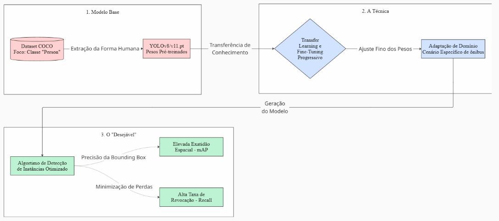
   
  <b>Fluxo de Geração do Modelo a partir do Dataset COCO até a Adaptação de Domínio</b>

O núcleo do projeto avalia comparativamente duas estratégias de *Transfer Learning* e *Fine-Tuning*:

1. **Estratégia 1: Baseline (Fine-Tuning Direto):** Utilização do modelo pré-treinado e realização do fine-tuning diretamente nas imagens anotadas de datasets públicos do interior de ônibus. É a abordagem mais simples e rápida, porém altamente propensa a overfitting.
2. **Estratégia 2: Fine-Tuning em Estágios (Robusto):** Implementação de treinamento sequencial visando o fechamento progressivo do *gap* de domínio (de multidão "geral" para multidão "confinada"). Realizou-se um fine-tuning inicial (Estágio 1) no dataset CrowdHuman para ajuste de sobreposição, seguido por um segundo fine-tuning (Estágio 2) nas imagens do interior do ônibus.

  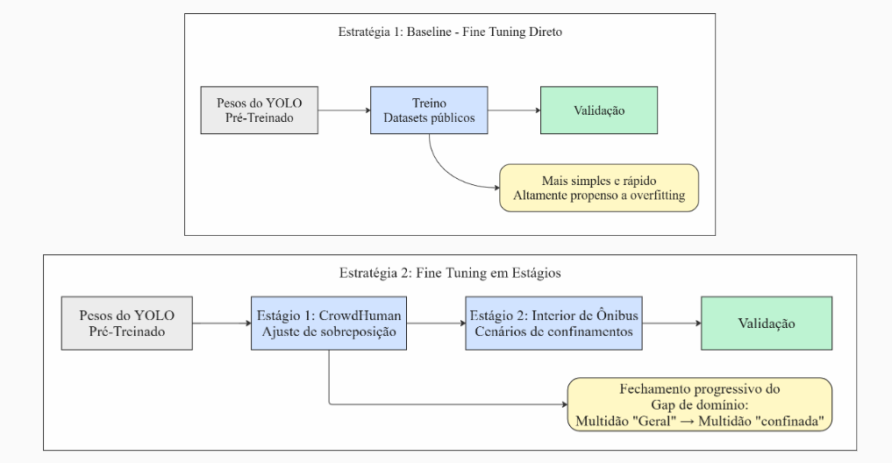
   
  <b>Comparativo das Arquiteturas de Treinamento: Direto (Estratégia 1) vs. Estágios Sequenciais (Estratégia 2)</b>

### Avaliação de Generalização e Validação:

Para ambas as abordagens, etapas sequenciais foram executadas com o objetivo de comparar a precisão documentada nos datasets de origem e validá-la por meio de validação cruzada(cross-dataset), utilizando ausentes do conjunto de treinamento. Como exemplo, aplicar inicialmente o aprendizado por transferência(Transfer Learning) utilizando o dataset "Passenger Detection on a Bus" para estabelecer a precisão de referência. Em sequência, o modelo será avaliado com um subconjunto de imagens tratadas do dataset "Inside Bus View", com o intuito de analisar a eventual degradação da precisão em novos cenários.

### Pré-processamento e Robustez

Para mitigar o overfitting e aprimorar a robustez, aplicou-se:
* **Normalização de Classes:** Todos os datasets foram convertidos para uma classe-alvo única (`person`), descartando classes irrelevantes ou remapeando classes como `occupied seat`.
* **Limpeza e Redução de Volume:** Remoção de amostras ruidosas e aplicação de subamostragem orientada à redundância temporal/visual.
* **Data Augmentation:** Aplicou-se um pipeline de transformações para simular oclusão, trepidação e limitações severas de hardware.

  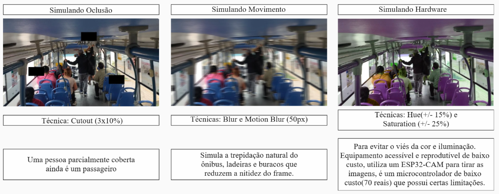
   
  <b>Pipeline de Data Augmentation: Simulações de Oclusão (Cutout), Movimento (Blur) e Hardware</b>

## Bases de Dados
<!-- > 
Elencar as bases de dados utilizadas no projeto. 

Faça uma descrição sobre o que o grupo concluiu sobre esta base. Sugere-se que respondam perguntas ou forneçam informações indicadas a seguir:
* Qual o formato dessa base, tamanho, tipo de anotação?
* Quais as transformações e tratamentos feitos? Limpeza, reanotação, etc.
* Utilize tabelas e/ou gráficos que descrevam os aspectos principais da base que são relevantes para o projeto.

Forneça também o link para o "datasheet" criado para os datasets (anexado na pasta `data`, como indicado nas [instruções E2](https://github.com/Disciplinas-FEEC/IA901-2026S1/blob/main/templates/ia901-E2-instructions.md)), contendo informações mais detalhadas e sistematizadas sobre as bases de dados.
-->

O projeto implementa uma arquitetura de dados baseada no padrão Medalhão (`data/raw`, `data/interim` e `data/processed`). A tabela abaixo resume a volumetria bruta e a volumetria final utilizada após a limpeza:

| Dataset | Origem / Fonte | Volume Bruto (Raw) | Volume Utilizado (Processed) | Classe Alvo | Papel Experimental / Etapa |
| ----- | ----- | ----- | ----- | ----- | ----- |
| Inside Bus View | Roboflow Universe | 1378 imagens | 93 imagens | person (remap de Occupied) | Treinamento (Base) e Teste In-Distribution |
| Passenger (Deakin) | Roboflow Universe | 4181 imagens | 641 imagens | person (remap de passenger) | Treinamento (Base) e Teste In-Distribution |
| CrowdHuman | Hugging Face Hub | 19370 imagens | 19370 imagens | person | Pré-treinamento (Estágio 1 - Metodologia Robusta) |
| Passenger Detection | Roboflow Universe | 170 imagens | 170 imagens | person (remap de passenger) | Teste de Generalização (Out-of-Distribution) |
| Dataset Privado | Coleta Própria | 583 imagens | 583 imagens | person | Validação Final em Cenário Real (Ônibus Unicamp) |

  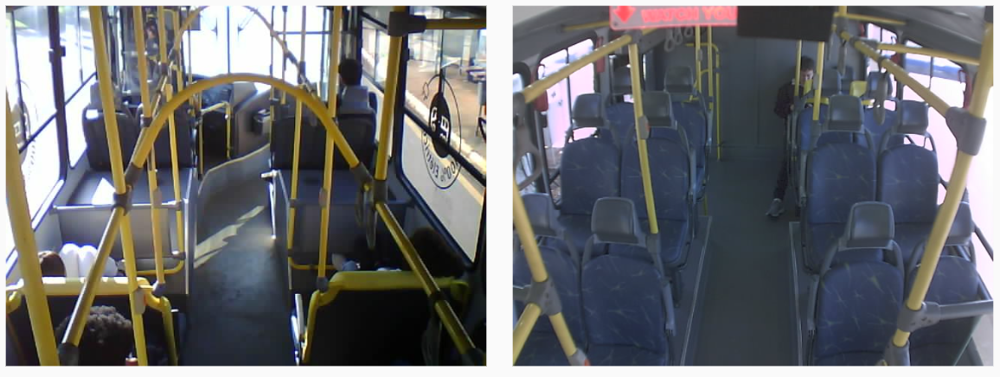
   
  <b>Exemplos Visuais do Dataset Privado: Coleta de Imagens no Interior do Ônibus Elétrico da Unicamp</b>

<!-- > Forneça também o link para o "datasheet" criado para os datasets (anexado na pasta `data`, como indicado nas [instruções E2](https://github.com/Disciplinas-FEEC/IA901-2026S1/blob/main/templates/ia901-E2-instructions.md)), contendo informações mais detalhadas e sistematizadas sobre as bases de dados. -->

### Transformações e Tratamentos Aplicados (Camada Processed)

Para padronizar os dados e viabilizar a convergência das arquiteturas YOLOv8 e YOLO11, o pipeline de pré-processamento executado em `2_preprocess_datasets.ipynb` (com suporte do módulo `src/datasets.py`) submete os dados brutos aos seguintes tratamentos determinísticos:

1. **Remapeamento de Classes para Alvo Único (`nc=1`):** Redução categórica obrigatória para unificar o escopo estritamente na classe `person` (ID `0`). No dataset *Inside Bus View*, as anotações nativas rotuladas originalmente como `occupied seat` foram remapeadas programaticamente para `person`. Classes espúrias ou irrelevantes ao problema de contagem foram integralmente descartadas do arquivo final.
2. **Normalização e Parsing de Coordenadas:** Conversão de anotações complexas e polígonos em formatos de caixas delimitadoras normatizadas (*bounding boxes*) padrão YOLO, expressas em coordenadas relativas de centro da caixa e dimensões de borda $[cx, cy, nw, nh]$ limitadas rigidamente no intervalo $[0.0, 1.0]$ para evitar erros de consistência.
3. **Reamostragem e Controle de Reprodutibilidade (CrowdHuman):** Devido à volumetria massiva do CrowdHuman original (mais de 19 mil imagens), foi desenvolvido um motor de amostragem aleatória determinística (fixado com `seed=42`) para extrair splits balanceados e compactos na camada `processed` (ex: 800 imagens de treino, 200 de validação e 200 de teste), viabilizando ciclos rápidos de iteração de código (*Fast Mode*).
4. **Geração de Metadados de Runtime:** Criação automática de arquivos de ancoragem `data.yaml` e arquivos ocultos de validação de integridade (`.download_complete`) para garantir que o motor de treinamento consuma os caminhos de forma correta e limpa.

> **Nota sobre os Datasheets:** Os documentos detalhados de especificação (*datasheets*) contendo a distribuição interna de caixas, volumetria final pós-limpeza e análises estatísticas encontram-se estruturados no diretório [`data/`](data/). Por questões de otimização de armazenamento no GitHub, os gráficos de distribuição descritiva foram incorporados diretamente nos painéis das respectivas bases no Roboflow.

## Ferramentas
<!-- > 
Panorama das ferramentas utilizadas incluindo uma breve discussão sobre o uso das mesmas. 
-->
O desenvolvimento deste projeto possui uma arquitetura possuindo reprodutibilidade, rastreabilidade e bom desempenho na extração de características.

* **Modelos Base e Deep Learning:**
  * **Família YOLO (Ultralytics):** Utilização das arquiteturas estado-da-arte YOLOv8 e YOLO11 (com foco nas variantes *medium*, como YOLO11m) devido ao excelente balanço entre precisão de detecção (mAP) e velocidade de inferência, requisito importante na questão de escalabilidade pelo "custo benefício".
  * **PyTorch:** Framework base subjacente para processamento de tensores e aceleração de hardware via CUDA, permitindo o treinamento otimizado com grandes matrizes de dados.

* **Engenharia de Dados (Pipeline ETL):**
  * **Roboflow API:** Plataforma adotada para gestão, anotação e versionamento automatizado dos datasets do domínio alvo (imagens do interior dos ônibus).
  * **Hugging Face Hub:** Utilizado para a extração programática dos arquivos brutos e anotações matriciais do dataset de domínio geral (CrowdHuman) utilizado na etapa de robustez.
  * **Pillow, OpenCV e NumPy:** Stack base para decodificação de imagens, normalização de coordenadas de *bounding boxes* e formatação dos conjuntos de dados.

* **Monitoramento e Gestão de Experimentos (MLOps):**
  * **Weights & Biases (WandB):** Ferramenta central para o rastreamento do ciclo de vida dos modelos. Utilizada para registrar métricas de perda (*loss*) em "tempo real", gerar painéis de validação visual preditiva e gerenciar as execuções sistemáticas da busca em grade (*Grid Search*) para a otimização dos hiperparâmetros.

* **Ambiente de Desenvolvimento:**
  * **Python 3.12 e Jupyter Notebooks:** Orquestração do fluxo de trabalho estruturada no padrão Raw, Interim, Processed. A base de código implementa tipagem estática e documentação padronizada para assegurar a confiabilidade da pesquisa.

* **Camada de Ambiente:** A execução isolada do ambiente é gerenciada pelo **uv** (gerenciador de pacotes Python).
* **Camada de Configuração:** O isolamento rigoroso dos parâmetros de treinamento é feito através da injeção de configurações via arquivo `config.yaml`, permitindo alterar conjuntos de dados ou estratégias com uma única string.

## Workflow reprodutível
<!-- > 
Use uma ferramenta que permita desenhar o workflow e salvá-lo como uma imagem (Draw.io, por exemplo). Insira a imagem nesta seção.
Você pode optar por usar um gerenciador de workflow (Sacred, Pachyderm, etc) e nesse caso use o gerenciador para gerar uma figura para você.
Lembre-se: o objetivo de desenhar o workflow é ajudar a quem quiser reproduzir seus experimentos!!!

-->

A arquitetura do projeto foi estruturada visando a total reprodutibilidade e o princípio de Separação de Preocupações (SoC). O pipeline foi dividido em notebooks modulares, estabelecendo limites claros entre a engenharia de dados (ETL), a modelagem (Treinamento) e a validação de hipóteses (Avaliação).

### Tabela de Artefatos e Rastreabilidade

| Etapa | Módulos e Notebooks | Entrada | Saída (Artefato) |
| --- | --- | --- | --- |
| **1. Extração (Download)** | `1_download_datasets.ipynb` `src/datasets.py` | API do Roboflow e Hugging Face Hub | `data/raw/<dataset>/` |
| **2. Pré-processamento** | `2_preprocess_datasets.ipynb` `src/datasets.py` | `data/raw/<dataset>/` | Dataset final em `data/processed/<dataset>/` |
| **3. Treinamento** | `3_train.ipynb` `src/train.py` `src/wandb_utils.py` | `data/processed/<dataset>/data.yaml` | Pesos do modelo (`runs/<exp>/weights/`) Logs no Weights & Biases |
| **4. Validação (Robustez)** | `4_validate_test.ipynb` `src/eval.py` `src/wandb_utils.py` | Pesos treinados (`best.pt`) Domínio não visto (`data/processed/`) | `runs/<exp>/test_metrics.json` Painel de predições no W&B |

<!-- Fazer um workflow melhor no Miro -->
O fluxograma abaixo ilustra o ciclo de vida dos dados, desde as fontes externas até a consolidação das métricas de avaliação no Weights & Biases.

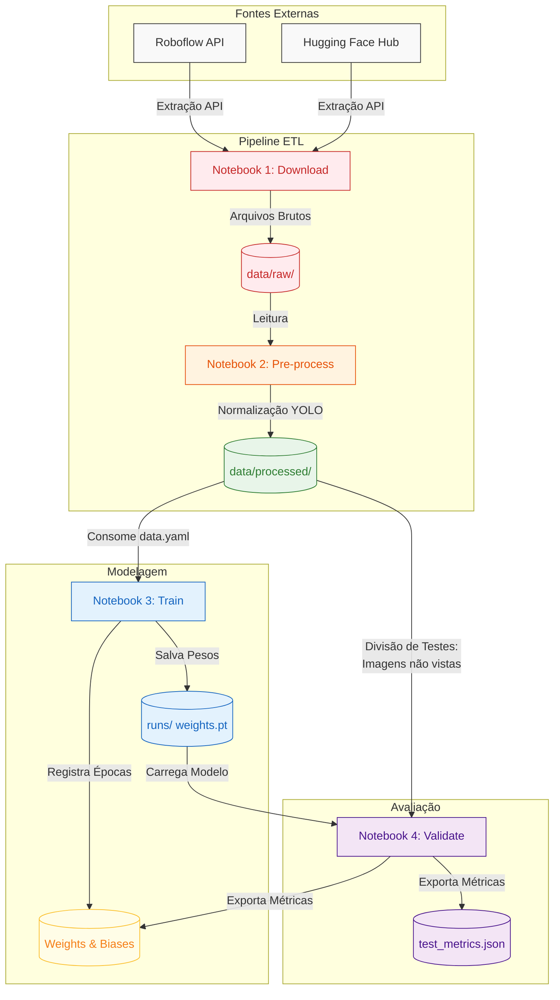

As instruções de execução dos notebooks ficam em [`src/README.md`](src/README.md).
Detalhes do registro no Weights & Biases ficam em [`docs/WANDB.md`](docs/WANDB.md).

## Experimentos e Resultados
<!-- > 
Descrição dos resultados mais importantes obtidos.
Apresente os resultados da forma mais rica possível, com gráficos e tabelas. Mesmo que o seu código rode online em um notebook, copie para esta parte a figura estática. A referência a código e links para execução online pode ser feita também, mas é preciso apresentar os principais resultados neste documento.
-->

### Experimentos:

### 1. Falha de Generalização (Cross-Domain)
Os experimentos iniciais confirmaram que treinar em um único dataset não transfere bem para outro dataset, mesmo com a mesma tarefa. No cenário *in-domain* a métrica é boa, mas no *cross-dataset* cai severamente.

| Modelo | Treino | Teste | mAP50 | Precision | count_mae | count_me |
|---|---|---|---|---|---|---|
| el-dkn | passenger-deakin | passenger-deakin | 0.650 | 0.707 | 2.093 | +0.381 |
| el-dkn | passenger-deakin | inside-bus-view | 0.440 | 0.581 | 5.533 | -5.533 |
| el-ibv | inside-bus-view | inside-bus-view | 0.876 | 0.881 | 1.133 | +0.333 |
| el-ibv | inside-bus-view | passenger-deakin | 0.128 | 0.284 | 4.340 | -3.433 |

### 2. Multi-dataset Fine-Tuning (In-Domain)
A combinação de datasets públicos no fine-tuning (`e2-public-default`) superou claramente a arquitetura genérica base (`yolo11m`) dentro do domínio de treino.

| Métrica (média do test set inside-bus-view + passenger-deakin) | Baseline yolo11m | e2-public-default |
|---|---|---|
| mAP50 | 0.271 | 0.759 |
| Precision | 0.338 | 0.800 |
| count_mae | 5.922 | 1.289 |
| count_me | -4.980 | -0.008 |

### 3. Avaliação em Domínios Não Vistos (Público vs. Privado)
Avaliamos a estratégia direta (`e2`) contra o fine-tuning em estágios com o CrowdHuman (`e3`) e o modelo Baseline. 

* **Teste Público:** O fine-tuning melhora significativamente a detecção.

  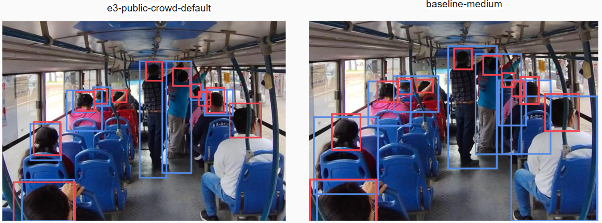
   
  <b>Figura 1: Predições no Dataset de Teste Público (e3-public-crowd-default vs. baseline-medium)</b>

* **Teste Privado (Unicamp):** De forma surpreendente, o baseline generalista venceu as abordagens de fine-tuning público em detecção e contagem no mundo real.

  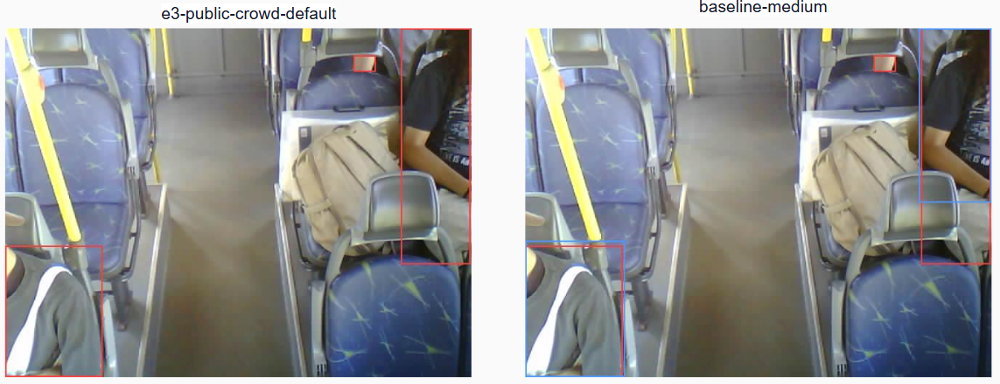
   
  <b>Figura 2: Predições no Dataset Privado da Unicamp (e3-public-crowd-default vs. baseline-medium)</b>

| Testing dataset | Modelo | mAP50 | Precision | count_mae | count_me |
|---|---|---|---|---|---|
| passenger-detection-bus | baseline-medium | 0.064 | 0.112 | 1.706 | -0.882 |
| passenger-detection-bus | e2-public-default | 0.569 | 0.643 | 3.588 | -3.118 |
| passenger-detection-bus | e3-public-crowd-default | 0.605 | 0.673 | 2.294 | -1.824 |
| onibus-unicamp-private | baseline-medium | 0.612 | 0.723 | 1.185 | -1.032 |
| onibus-unicamp-private | e2-public-default | 0.134 | 0.310 | 1.955 | -1.904 |
| onibus-unicamp-private | e3-public-crowd-default | 0.156 | 0.319 | 1.803 | -1.662 |

### 4. Adaptação In-Domain (Teste Privado)
Para contornar o problema, implementou-se a estratégia `e4-private-adapt-medium`, introduzindo adaptação *in-domain* com aproximadamente 362 imagens privadas de treino. O modelo passou a liderar no domínio real, reduzindo erros de contagem e praticamente zerando o viés.

| Modelo | mAP50 | Precision | count_mae | count_me |
|---|---|---|---|---|
| e0-baseline-medium | 0.612 | 0.723 | 1.185 | -1.032 |
| e4-private-adapt-medium | 0.789 | 0.812 | 0.682 | -0.006 |

## Discussão
<!-- 
Discussão dos resultados. Relacionar os resultados com as perguntas de pesquisa ou hipóteses avaliadas.
A discussão dos resultados também pode ser feita opcionalmente na seção de Resultados, na medida em que os resultados são apresentados. Aspectos importantes a serem discutidos: É possível tirar conclusões dos resultados? Quais? Há indicações de direções para estudo? São necessários trabalhos mais profundos?
-->

O modelo especializado nos datasets públicos funciona muito bem dentro de seu domínio de treino e chegou a melhorar os resultados em testes públicos similares não vistos. Contudo, no teste privado da Unicamp, o desempenho despencou. 

Essa falha ocorreu porque o dataset privado representa um **domínio próprio**, caracterizado por um cenário com mais oclusão e uma vasta presença de corpos parciais (braços, pernas ou troncos isolados nos cantos do frame), algo muito diferente do que predominava nos dados públicos. A tentativa de reduzir esse gap com o uso de *augmentations* ofereceu um ganho parcial, mas insuficiente para fechar o domínio. Portanto, a adaptação *in-domain* (inserir dados reais da câmera alvo no treino) se mostrou a etapa crítica para destravar o desempenho na aplicação real.

## Conclusão
<!-- 
Destacar as principais conclusões obtidas no desenvolvimento do projeto.
Destacar os principais desafios enfrentados.
Principais lições aprendidas.
-->

1. Treinar em um dataset único não garante generalização, mesmo mantendo a mesma tarefa.
2. O treinamento agregado em múltiplos datasets públicos melhorou a generalização no teste público não visto (superando o baseline).
3. Um modelo especializado de forma exagerada em um conjunto restrito de domínios (datasets públicos) pode degradar severamente o desempenho em domínios fora dele, ficando com uma performance inferior a de um *baseline* generalista no mundo real (dataset privado).
4. A adaptação *in-domain* elevou o desempenho no domínio real (aumentando mAP50 e Precision) e praticamente zerou o viés da contagem.
5. O uso do dataset CrowdHuman ajudou no fine-tuning de cenários similares de multidão, mas não conseguiu substituir a necessidade de dados *in-domain* para contagem no ônibus real (devido ao *mismatch* no tipo de oclusão).

**Lições Aprendidas:**
* A representatividade de um dataset depende diretamente da diversidade das imagens e não apenas do volume total de amostras.
* Generalização só abrange os domínios efetivamente representados no treinamento. Para domínios "de borda", os dados in-domain são a principal alavanca, enquanto dados proxy (como CrowdHuman) ajudam, mas não substituem.
* Treinamentos com modelos pesados localmente demandam alto poder de processamento, e o aumento excessivo de épocas provoca overfitting, sendo obrigatório definir critérios de parada (Early Stopping) adequados.

## Trabalhos Futuros
<!-- O que poderia ser melhorado se houvesse mais tempo? -->
* **Atacar a lacuna do dataset privado:** Incluir mais dados *in-domain* coletados em cenários de dificuldade extrema (condições de baixa luz, reflexos nos vidros, superlotação extrema e presença de corpos parciais), além de desenvolver *augmentations* de oclusão mais realistas (ex: ocluir partes específicas de pessoas com poltronas ou barras, em vez de recortes genéricos aleatórios).
* **Explorar Modelos Fundacionais (Foundation Models):** Testar arquiteturas como o Segment Anything Model (SAM) para avaliar a robustez à segmentação em massa e verificar se as abordagens e *augmentations* de oclusão desenvolvidas neste estudo transferem-se de maneira mais eficiente do que nos modelos YOLO convencionais.

## Uso de IA Generativa
<!-- > 
Adicione aqui em quais tarefas foi usada alguma ferramenta de IA Generativa. Para cada tarefa indicada detalhe qual a ferramenta e qual o prompt utilizado. 
-->
Durante o desenvolvimento deste projeto e a elaboração desta documentação, ferramentas de IA Generativa foram utilizadas estritamente para auxiliar na estruturação visual, diagramação e formatação do texto do repositório, não interferindo na concepção da metodologia. Abaixo estão os detalhes das tarefas:

* **Tarefa:** Apoio ao desenvolvimento e organização do código do projeto, incluindo estruturação dos módulos em `src/` e adaptação do notebook para funções reutilizáveis.
  * **Ferramenta:** Cursor
  * **Forma de uso:** Interação iterativa em linguagem natural durante a implementação, sem um único prompt principal; as sugestões foram revisadas, testadas e ajustadas pelos autores.

* **Tarefa: Geração do código do diagrama de Workflow**
  * **Ferramenta:** Gemini
  * **Prompt utilizado:** Fornecimento do texto descritivo das seções de "Metodologia" e "Experimentos" do README, seguido do comando: *"Preciso gerar uma imagem do meu workflow para meu projeto"*. A IA processou o texto e gerou o código em linguagem Mermaid, que foi posteriormente importado para a plataforma Mermaid e ajustado para a exportação da imagem final.

* **Tarefa: Estruturação e formatação das Referências Bibliográficas e documentação Readme.**
  * **Ferramenta:** Gemini
  * **Prompt utilizado:** Fornecimento dos links brutos (URLs) das bases de dados, bibliotecas e documentações, acompanhado do comando: *"Preciso ajustar minhas referencias para meu .md"*. A ferramenta categorizou os links e aplicou a sintaxe correta de hiperlinks nativa do Markdown.

## Referências
<!-- > Seção obrigatória. Inclua aqui referências utilizadas no projeto. -->
**Bibliotecas e Frameworks**
* **[PyTorch](https://pytorch.org/):** Framework principal de Deep Learning utilizado no projeto.
* **[Ultralytics (YOLO)](https://docs.ultralytics.com/):** Documentação oficial das arquiteturas YOLOv8 e YOLOv11.
* **[Artigo](https://doi.org/10.1177/036119811985233):** Impact of Time-Varying Passenger... (Luying Liu et al., 2019).

**Bases de Dados (Datasets)**
* **[Roboflow - Passenger Detection on a Bus](https://universe.roboflow.com/bus-project-frdgz/passenger-detection-on-a-bus-qgljh):** Dataset utilizado para teste de generalização.
* **[Roboflow - Inside Bus View](https://universe.roboflow.com/seat-occupancy/inside-bus-view):** Dataset focado na visão interna do ônibus.
* **[Roboflow - Passenger (Deakin)](https://universe.roboflow.com/deakin-07shj/passenger-mmpbi):** Dataset auxiliar de passageiros utilizado no fine-tuning.
* **[CrowdHuman Dataset (Página Oficial)](https://www.crowdhuman.org/):** Dataset de multidões utilizado para o fine-tuning no Estágio 1.

**Ferramentas de Experimentação e MLOps**
* **[Weights & Biases](https://wandb.ai/site/):** Plataforma integrada para o registro de experimentos e monitoramento de métricas de convergência.
* **uv:** Gerenciador de dependências e ambiente em Python.