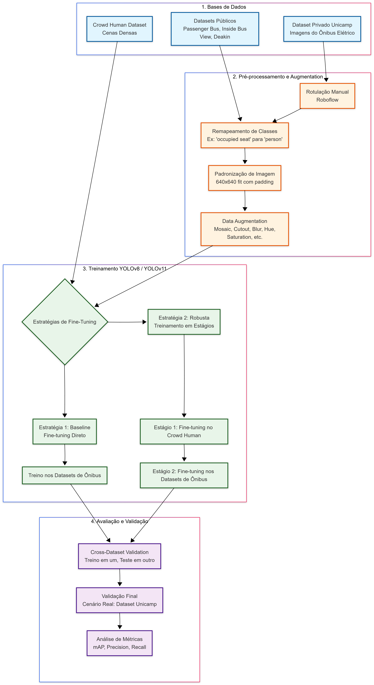

# `Contagem de passageiros em ônibus utilizando visão computacional (análise de imagens e reconhecimento de padrões).`
# `Counting passengers on buses using computer vision (image analysis and pattern recognition).`

## Apresentação

O presente projeto foi originado no contexto das atividades da disciplina de pós-graduação *IA901 - Análise de Imagens e Reconhecimento de Padrões*, 
oferecida no primeiro semestre de 2026, na Unicamp, sob supervisão da Profa. Dra. Leticia Rittner, do Departamento de Engenharia de Computação e Automação (DCA) da Faculdade de Engenharia Elétrica e de Computação (FEEC).

<!-- > Incluir nome RA e foco de especialização de cada membro do grupo. Os projetos devem ser desenvolvidos em duplas ou trios. -->
> |Nome  | RA | Curso|
> |--|--|--|
> | Vinícius de Souza Trentin  | 298990  | Mestrado em Engenharia Elétrica com ênfase em computação|
> | Cristian Javier Maza Merchan  | 272289  | Mestrado em Engenharia Elétrica, Doutorado em Engenharia Elétrica.

## Descrição do Projeto
<!-- > Descrição do objetivo principal do projeto, incluindo contexto gerador, motivação, etc. Qual problema você pretende solucionar? Qual a relevância do problema e o impacto da solução do mesmo? -->

O objetivo do projeto é desenvolver um algoritmo capaz de detectar e contabilizar o número de passageiros presentes em imagens no interior de ônibus. A solução utilizará técnica de transfer learning a partir de modelos de detecção de objetos pré-treinados, como YOLOv8 ou YOLOv11 treinados no dataset COCO para a classe "person". Diversos datasets públicos que contem imagens de pessoas em ônibus possuem precisão elevada, porém quando são colocados em situações diferentes, como validando com uma imagem de outro dataset, essa precisão diminui, chegando até porcentagens superiores de 20% a menos, por exemplo.

A relevância deste projeto reside na tentativa de desenvolver um algoritmo de detecção de passageiros que tenha uma boa precisão na detecção em diferentes cenários, a noção da quantidade de passageiros em ônibus pelo tempo contribui na otimização da mobilidade urbana e na análise de impacto da massa de passageiros, sendo importante para o consumo energético de ônibus elétricos, com aplicação direta no ônibus elétrico da Unicamp.

## Metodologia
<!-- > Proposta de metodologia incluindo especificação de quais técnicas pretende-se explorar. Espera-se que nesta entrega você já seja capaz de descrever de maneira mais específica (do que na Entrega 1) quais as técnicas a serem empregadas em cada etapa do projeto. -->
A metodologia consiste na aplicação de Redes Neurais Convolucionais (CNNs), principalmente da arquitetura da família YOLO (YOLOv8 e YOLOv11) para extração de características espaciais e detecção de instâncias, no caso pessoas. O núcleo do projeto avaliará comparativamente duas estratégias de Transfer Learning e Fine-Tuning:
1. **Fine-tuning direto (Baseline):** Utilizar o modelo pré-treinado e realizar o fine-tuning diretamente nas imagens anotadas do interior dos ônibus(datasets públicos). Esta é a abordagem mais simples e será utilizada como base para a avaliação de desempenho.
2. **Fine-tuning em estágios (Robusto):** Implementar um treinamento seguencial, em que será realizado um fine-tuning inicial em um dataset de cenas de multidões(Crowd Human Dataset) para melhorar a robustez contra oclusões. Em seguida, aplicar um segundo fine-tuning com as imagens de passageiros no interior do ônibus, fechando o gap de domínio progressivamente.

### Avaliação de Generalização e Validação:

Em ambas abordagens será feita etapas sequenciais comparando a precisão relatadas nos datasets utilizados e validando com uma imagem de outro dataset(cross-dataset) em que não foi utilizada no treinamento. Por exemplo primeiramente fazer um transfer learning com o dataset Passenger Detection on a Bus e ver a precisão obtida, depois pegar algumas imagens do dataset limpo de Inside Bus View e ver a precisão que irá obter, analisando a perda de precisão em novos cenários.

### Pré-processamento e Robustez

Adicionalmente, para tentar diminuir o risco de overfitting e melhorar a robustez frente a diferentes ambientes, serão aplicados métodos de pré-processament(como remapeamento de classes, em Inside Bus View transformar "occupied seat" em "person" e descartar classes irrelevantes) e Data Augmentation(para lidar com variações de iluminação, como brilho e contraste e oclusões artificiais).

A validação final será realizada no dataset privado da Unicamp, sendo analisado o desempenho em um "cenário real de operação".

## Bases de Dados e Evolução
<!-- > Elencar as bases de dados utilizadas no projeto. -->

| Base de Dados | Endereço na Web | Resumo descritivo |
| ----- | ----- | ----- |
| Passenger Detection on a Bus | [Roboflow Universe](https://universe.roboflow.com/bus-project-frdgz/passenger-detection-on-a-bus-qgljh) | 170 imagens (.jpg) de passageiros em ônibus com bounding boxes precisas. Será utilizada para treinamento (Etapa 1 e 2) |
| Inside Bus View | [Roboflow Universe](https://universe.roboflow.com/seat-occupancy/inside-bus-view) | 1.400 imagens (.jpg) com anotações de assentos ocupados, que serão remapeadas para a classe "person". Será utilizada para treinamento e teste (Etapa 1 e 2)  |
| Crowd Human Dataset | [CrowdHuman.org](https://www.crowdhuman.org/) | 19.370 imagens (.jpg) contendo instâncias humanas em cenas densas para o treinamento em estágios. Será utilizada para treinamento(Etapa 2)  |
| Passenger (Deakin) | [Roboflow Universe](https://universe.roboflow.com/deakin-07shj/passenger-mmpbi) | 4181 imagens (.jpg), será aplicada subamostragem (1 a cada 40 frames) resultando em torno de 100 imagens (.jpg). Será utilizada para treinamento e teste(Etapa 1 e 2) |
| Dataset Privado (Unicamp) | N/A | 2.400 imagens (.jpeg) coletadas no ônibus elétrico da Unicamp para rotulação manual e validação final. |

<!-- > Forneça também o link para o "datasheet" criado para os datasets (anexado na pasta `data`, como indicado nas [instruções E2](https://github.com/Disciplinas-FEEC/IA901-2026S1/blob/main/templates/ia901-E2-instructions.md)), contendo informações mais detalhadas e sistematizadas sobre as bases de dados. -->
> O "datasheet" contendo a sistematização destas bases encontra-se no diretório `data/`, por questões de limitação do github para imagens, foram adicionadas no Google drive e disponibilizados links de cada pasta separada.

## Ferramentas
<!-- > Ferramentas e/ou bibliotecas já utilizadas e/ou ainda a serem utilizadas (com base na visão atual do grupo sobre o projeto). -->
* **Modelos Base:** YOLOv8 e YOLOv11.
* **Linguagem e Bibliotecas:** Python, OpenCV, Pandas, NumPy, PyTorch, ...
* **Plataformas de Anotação/Gestão de Dados:** Roboflow, WandDB.

## Workflow
<!-- > Use uma ferramenta que permita desenhar o workflow e salvá-lo como uma imagem (Draw.io, por exemplo). Insira a imagem nesta seção.
> Você pode optar por usar um gerenciador de workflow (Sacred, Pachyderm, etc) e nesse caso use o gerenciador para gerar uma figura para você.
> Lembre-se que o objetivo de desenhar o workflow é ajudar a quem quiser reproduzir seus experimentos.
> Mais informações sobre o workflow podem ser encontradas nos materiais de apoio no Classroom (Reprodutibilidade em pesquisa computacional - workflow). -->

## Experimentos e Resultados preliminares
<!-- > Descreva de forma sucinta e organizada os experimentos realizados.
> Para cada experimento, apresente os principais resultados obtidos.
> Aponte os problemas encontrados nas soluções testadas até aqui. -->

Os experimentos iniciais utilizarão o modelo YOLO base para estabelecer o baseline de performance. Como primeiro experimento foi feito um treinamento utilizando o dataset Passenger Detection on a Bus, esse dataset possui 170 imagens de pessoas em ônibus, os dados foram pré processados utilizando orientação sempre na horizontal e na escala 640x640 fit com preenchimento preto nas bordas para não distorcer as imagens. Como data augmentation foram utilizadas as técnicas de:
* Flip Mirror horizontally: Dobra o dataset sem distorcer a física da imagem, fazendo com que tenha imagens de pessoas que estavam na esquerda ficarem também na direita, já que os ônibus são simétricos.
* Mosaic: Combina 4 imagens em 1, fazendo com que a rede "foque" em contextos variados.
* Brightness: Variar o brilho da imagem, regulável, escolhemos de +/- 15%
* Exposure: Variar a exposição da imagem, regulável, escolhemos de +/- 10%
* Cutout: Caixas pretas aleatórias que irão cobrir alguma parte da imagem, também é regulável, escolhemos de 3 x 10%, esse parâmetro pode ajudar no problema de oclusão, mesmo que um quadrado preto(simulando alguma oclusão, como uma barra de ferro do ônibus, poltrona,...) esconder alguma parte do corpo de uma pessoa, o restante ainda é um passageiro.
* Rotation: rotação variável, escolhemos de +/- 10% para simular a variação que pode acontecer da câmera do ônibus balançar/trepidar.
* Blur: Aplicar efeito de "embaçamento", escolhemos para ser menor ou igual a 1px, pois acreditamos que pelas imagens isso não acontece tanto e poderia piorar o modelo.
* Motion Blur: semelhante ao blur, porém simulando uma movimentação, escolhemos como parâmetro 50px 0 graus e 1 frame.
* Hue, variar a escala de cores da imagem, escolhemos +/- 15%. Esse parâmetro ajuda o modelo não ficar tão inviesado em relação a cores, como de roupas e tom de pele.
* Saturation: Variar a saturação da imagem, escolhemos de +/- 25%, câmeras simples(como a do ESP32-CAM, utilizada no modelo do dataset privado no ônibus da Unicamp, ou câmeras similares) costumam ter um balanço de branco ruim, deixando a imagem mais "azulada" ou "amarelada"(cores frias e quentes), a saturação também pode ajudar na questão de viés em relação a cores que nem o Hue.
* Crop: Variar corte ou zoom, escolhemos de 0 a 20%, essa técnica aproxima a imagem artificialmente, pode ajudar o modelo aprender a detectar pessoas que estão coladas na câmera, que pode acontecer

De `Epoch` foram utilizadas 300 para o treinamento. 

No roboflow do repositório Passenger Detection on a Bus estava com uma precisão de 91.1%, com o nosso treinamento feito ficou com uma precisão de 93%.

No roboflow do repositório Inside Bus Detection estava com uma precisão de 90.2%, com o nosso treinamento feito ficou com uma precisão de  97%, porém utilizando o modelo do primeiro dataset nesse dataset para validar e verificar a precisão, diminuiu para 31% evidenciando o problema que retratamos de um dataset ficar específico para o conjunto de imagens treinados e quando jogado em outro dataset cair drasticamente a precisão.

**Problemas identificados até o momento:**
* Risco elevado de oclusão severa gerando subcontagem (falsos negativos) e sobreposição de detecções (contagem dupla).
* Viés de dataset (overfitting) e necessidade de simular diversidade, como de iluminação, dos parâmetros de data augmentation, porém mesmo utilizando esses parâmetros o caso ao contrário do primeiro dataset(Passenger Detection on a Bus) sendo para ser validado no Inside Bus View também ficou com precisão bem abaixo.
* Dataset "passenger_count" foi avaliado preliminarmente e excluído devido a problemas severos de anotação (bounding boxes cobrindo múltiplas pessoas).

## Próximos passos
<!-- > Liste as próximas etapas planejadas para conclusão do projeto, com uma estimativa de tempo para cada etapa. -->
1. **Semana 1-2:** Realizar a rotulação manual de parte das 2.400 imagens do Dataset Privado da Unicamp utilizando a plataforma Roboflow.
2. **Semana 1:** Implementar e treinar o modelo baseline utilizando a técnica de fine-tuning direto (Estratégia 1), na questão de um modelo com um dataset e em seguida com outro dataset para treinamento também e não apenas de validação.
3. **Semana 1-2:** Executar o fine-tuning em estágios utilizando o CrowdHuman Dataset* seguido das bases de ônibus (Estratégia 2).
4. **Semana 2-3:** Avaliação quantitativa (mAP, Recall, Precision) e qualitativa das detecções no dataset da Unicamp, tanto com a Estratégia 1, quanto da Estratégia 2.

## Uso de IA Generativa
<!-- > Adicione aqui em quais tarefas foi usada alguma ferramenta de IA Generativa. Para cada tarefa indicada detalhe qual a ferramenta e qual o prompt utilizado. -->
Durante o desenvolvimento deste projeto e a elaboração desta documentação, ferramentas de IA Generativa foram utilizadas estritamente para auxiliar na estruturação visual, diagramação e formatação do texto do repositório, não interferindo na concepção da metodologia. Abaixo estão os detalhes das tarefas:

* **Tarefa: Geração do código do diagrama de Workflow**
  * **Ferramenta:** Gemini
  * **Prompt utilizado:** Fornecimento do texto descritivo das seções de "Metodologia" e "Experimentos" do README, seguido do comando: *"Preciso gerar uma imagem do meu workflow para meu projeto"*. A IA processou o texto e gerou o código em linguagem Mermaid, que foi posteriormente importado para a plataforma Mermaid e ajustado para a exportação da imagem final.

* **Tarefa: Estruturação e formatação das Referências Bibliográficas**
  * **Ferramenta:** Gemini
  * **Prompt utilizado:** Fornecimento dos links brutos (URLs) das bases de dados, bibliotecas e documentações, acompanhado do comando: *"Preciso ajustar minhas referencias para meu .md"*. A ferramenta categorizou os links e aplicou a sintaxe correta de hiperlinks nativa do Markdown.

## Referências
<!-- > Seção obrigatória. Inclua aqui referências utilizadas no projeto. -->
**Bibliotecas e Frameworks**
* **[PyTorch](https://pytorch.org/):** Framework principal de Deep Learning utilizado no projeto.
  > *Nota de instalação (versão estável com suporte a CUDA 12.6):* > `pip3 install torch torchvision --index-url https://download.pytorch.org/whl/cu126`
* **[Ultralytics (YOLO)](https://docs.ultralytics.com/):** Documentação oficial das arquiteturas YOLOv8 e YOLOv11 utilizadas para a detecção de objetos.

**Bases de Dados (Datasets)**
* **[Roboflow - Passenger Detection on a Bus](https://universe.roboflow.com/bus-project-frdgz/passenger-detection-on-a-bus-qgljh):** Dataset utilizado para o treinamento e detecção de passageiros no interior de ônibus.
* **[Roboflow - Inside Bus View](https://universe.roboflow.com/seat-occupancy/inside-bus-view):** Dataset focado na visão interna do ônibus (anotações de assentos mapeadas para passageiros).
* **[Roboflow - Passenger (Deakin)](https://universe.roboflow.com/deakin-07shj/passenger-mmpbi):** Dataset auxiliar de passageiros utilizado para compor as bases de treinamento e validação.
* **[CrowdHuman Dataset (Página Oficial)](https://www.crowdhuman.org/):** Página oficial do dataset de multidões utilizado para o fine-tuning em estágios, visando maior robustez contra oclusões.
* **[CrowdHuman Dataset (Hugging Face)](https://huggingface.co/datasets/sshao0516/CrowdHuman):** Repositório do dataset CrowdHuman hospedado no Hugging Face.